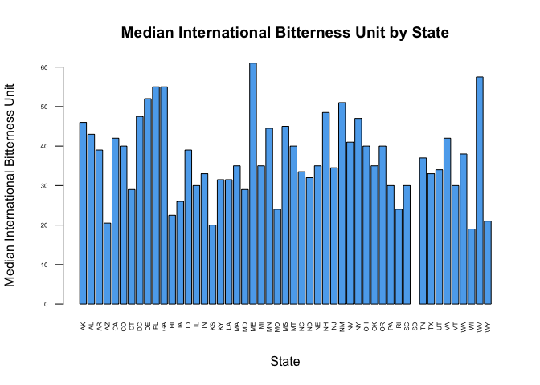

## Introduction

According to a report issued by the Brewers Association in 2016, "in just four years, the economic impact of small and independent U.S. craft brewers has doubled,". The study further reported that, "the inustry contributed $68.7B to the U.S. economy and provides more than 456,000 full time jobs"^[https://www.brewbound.com/news/study-us-craft-beer-industry-contributes-68-billion-economy].

Our study is geered towards understanding the beer industry and establishing possibilities for our client, on the premise that the beer industry is flourishing with an insatiable demand. Our research questions are:

* How many breweries are there in the United States?
* What brands of beer are produced most?
* How many ounces are commonly produced?
* Which brewery produces most brands of beer?
* Which state produces most beer?
* What is the alcoholic content and bitterness variability across the states?
* Is there a relationship between alcoholic contents and bitterness?

Analysing the industry's landscape will help our client determine whether it is beneficial to venture in the beer industry as well as the industry's growth stage i.e. whether it is exponential, stabilized, or declining. Our study provides a birds eye view on the overal brewing industry. We provide sufficient data to better understand how many breweries are out there in the industry and what types of beer are they producing.

## Data

We obtained two datasets consisting of 2 files. The first file, _Beers.csv_ contains a list of 2410 US craft beers. Each beer in the beers dataset is described by _name_, _ID_, _alcoholic content_ and _bitterness_, _style_ and _ounces_. The second dataset, _Breweries.csv_ contains 558 US breweries and 2305 distinct beers.  Each brewery is described by _name_, _ID_, _city_ and _state_. Our research will involve collating and analysing the two datasets. We shall use these two datasets to understand the breweries per state, the beer brands in the different breweries, the beer quality in terms of alcohol content and international bitterness unit and which states have beers with most alochol and most bitter.^[We have no information whether the data  collected was voluntary or as a result of state reporting requirement, as such we can vet into it's accuracy hence reliability]


```r
beers <- read.csv ('data/Beers.csv', header=T, sep=",")
breweries <- read.csv ('data/Breweries.csv', header=T, sep=",")
```
```

### Breweries Summary

The _summary_ function is used to obtain the summary statistic of _State_ column within _breweries_ data set. Below is a list of 51 states with the number of breweries present in each state:


```r
summary(breweries$State)
```

```
##  AK  AL  AR  AZ  CA  CO  CT  DC  DE  FL  GA  HI  IA  ID  IL  IN  KS  KY 
##   7   3   2  11  39  47   8   1   2  15   7   4   5   5  18  22   3   4 
##  LA  MA  MD  ME  MI  MN  MO  MS  MT  NC  ND  NE  NH  NJ  NM  NV  NY  OH 
##   5  23   7   9  32  12   9   2   9  19   1   5   3   3   4   2  16  15 
##  OK  OR  PA  RI  SC  SD  TN  TX  UT  VA  VT  WA  WI  WV  WY 
##   6  29  25   5   4   1   3  28   4  16  10  23  20   1   4
```

```r
summ <- data.frame(sapply(names(summary(breweries$State)), function(x) substring(x, 2)))
summ$Count <- as.numeric(summary(breweries$State))
colnames(summ) <- c('state', 'count')
plot_usmap(include = summ$state, data=summ, values='count') + labs(fill='Number of Breweries') + theme(legend.position="bottom")
```

<!-- -->

The top five states are:

1. Colorado, 47 breweries
1. California, 39 breweries
1. Michigan, 32 breweries
1. Oregon, 29 breweries
1. Pennsylvania, 25 breweries

Of these, three are in the west coast (Colorado, California, Oregon), one is a midwestern state (Michigan) and one is on the east coast (Pennsylvania). Overall there are 23 states with five breweries and below. The states with only one brewery are: District of Columbia, North Dakota, South Dakota and West Virginia. Two of these are in the east coast and two in the midwestern region of the United States. From this summary and the map we can see that west coast states have slightly larger number of breweries on average than other regions of the United States. Also, Colorado has distinctly larger number of breweries compared to the rest of the states.

### Beer Brands and Corresponding Breweries

To be able to analyse _International Bitterness Units_ (IBU) and _Alcohol by Volume_ (ABV) content of a beer at the state level we've merged datasets _breweries_ and _beers_ into a single table using brewery ID as a join key. The first and last 6 lines of the full table are shown below.


```r
names(breweries)[names(breweries) == "Brew_ID"] <- "Brewery_id"
beers_breweries <- merge(breweries,beers,by="Brewery_id")
head(beers_breweries)
```

```
##   Brewery_id             Name.x        City State        Name.y Beer_ID
## 1          1 NorthGate Brewing  Minneapolis    MN       Pumpion    2689
## 2          1 NorthGate Brewing  Minneapolis    MN    Stronghold    2688
## 3          1 NorthGate Brewing  Minneapolis    MN   Parapet ESB    2687
## 4          1 NorthGate Brewing  Minneapolis    MN  Get Together    2692
## 5          1 NorthGate Brewing  Minneapolis    MN Maggie's Leap    2691
## 6          1 NorthGate Brewing  Minneapolis    MN    Wall's End    2690
##     ABV IBU                               Style Ounces
## 1 0.060  38                         Pumpkin Ale     16
## 2 0.060  25                     American Porter     16
## 3 0.056  47 Extra Special / Strong Bitter (ESB)     16
## 4 0.045  50                        American IPA     16
## 5 0.049  26                  Milk / Sweet Stout     16
## 6 0.048  19                   English Brown Ale     16
```

```r
tail(beers_breweries)
```

```
##      Brewery_id                        Name.x          City State
## 2405        556         Ukiah Brewing Company         Ukiah    CA
## 2406        557       Butternuts Beer and Ale Garrattsville    NY
## 2407        557       Butternuts Beer and Ale Garrattsville    NY
## 2408        557       Butternuts Beer and Ale Garrattsville    NY
## 2409        557       Butternuts Beer and Ale Garrattsville    NY
## 2410        558 Sleeping Lady Brewing Company     Anchorage    AK
##                         Name.y Beer_ID   ABV IBU                   Style
## 2405             Pilsner Ukiah      98 0.055  NA         German Pilsener
## 2406         Porkslap Pale Ale      49 0.043  NA American Pale Ale (APA)
## 2407           Snapperhead IPA      51 0.068  NA            American IPA
## 2408         Moo Thunder Stout      50 0.049  NA      Milk / Sweet Stout
## 2409  Heinnieweisse Weissebier      52 0.049  NA              Hefeweizen
## 2410 Urban Wilderness Pale Ale      30 0.049  NA        English Pale Ale
##      Ounces
## 2405     12
## 2406     12
## 2407     12
## 2408     12
## 2409     12
## 2410     12
```

IBUs measure parts per million of isohumulone found in a beer according t0 the website^[https://beerconnoisseur.com]. It further adds that isohumulone is the acid found in hops that gives beer its bitter bite.  It's measurement raganges from 0-100, with 100 being the highest. Bitterness however is relative, as often its sweatened. On the other hand, ABV content is measured as a percentage. It shows how much of the beer is alcohol and legaly  required to be imprinted on the beer. 

### Missing Values

Before doing analysis of IBU and ABV content of beers we screened the data for missing values. Here is what we've found:

From our analysis,  only 'ABV' and 'IBU' columns contain 62 NA's, 1005 NA's respectively.

```r
  colSums(is.na(beers_breweries))
```

```
## Brewery_id     Name.x       City      State     Name.y    Beer_ID 
##          0          0          0          0          0          0 
##        ABV        IBU      Style     Ounces 
##         62       1005          0          0
```

### Median Alcohol Content (ABV) and International Bitterness Unit (IBU) per State

Main focus of this project is aggregate analysis of IBU and ABV levels. Here we looked at median IBU and ABV across the states. We found that the State of Utah  has the lowest median alcohol by volume at 0.40 while Washington DC and Kentucky have the highest median alcohol by volumne of the beer at 0.625.


```r
median_ABV <- tapply(beers_breweries$ABV, beers_breweries$State, median, na.rm = TRUE)
median_ABV
```

```
##     AK     AL     AR     AZ     CA     CO     CT     DC     DE     FL 
## 0.0560 0.0600 0.0520 0.0550 0.0580 0.0605 0.0600 0.0625 0.0550 0.0570 
##     GA     HI     IA     ID     IL     IN     KS     KY     LA     MA 
## 0.0550 0.0540 0.0555 0.0565 0.0580 0.0580 0.0500 0.0625 0.0520 0.0540 
##     MD     ME     MI     MN     MO     MS     MT     NC     ND     NE 
## 0.0580 0.0510 0.0620 0.0560 0.0520 0.0580 0.0550 0.0570 0.0500 0.0560 
##     NH     NJ     NM     NV     NY     OH     OK     OR     PA     RI 
## 0.0550 0.0460 0.0620 0.0600 0.0550 0.0580 0.0600 0.0560 0.0570 0.0550 
##     SC     SD     TN     TX     UT     VA     VT     WA     WI     WV 
## 0.0550 0.0600 0.0570 0.0550 0.0400 0.0565 0.0550 0.0555 0.0520 0.0620 
##     WY 
## 0.0500
```

```r
barplot(median_ABV, xlab = "State", ylab = "Median Alcohol Content", main = "Median Alcohol Content by State", col = "blue", las =2, cex.axis = .5, cex.names = .5)
```

<!-- -->


```r
abv_summ <- data.frame(sapply(names(median_ABV), function(x) substring(x, 2)))
abv_summ$abv <- as.numeric(median_ABV)
colnames(abv_summ) <- c('state', 'abv')
plot_usmap(include = abv_summ$state, data=abv_summ, values='abv') + labs(fill='ABV level') + theme(legend.position="bottom")
```

<!-- -->

On IBU measurement, Wisconsin has the lowest IBU measurement at 19.0, while Maine has the highest at 61.0. There was no IBU data for South Dakota. This is rather odd as in the united states, IBU percetage is required to be printed on the beer. The most likely reason is that the only brewery in South Dakota did not provide the data.  


```r
median_IBU <- tapply(beers_breweries$IBU, beers_breweries$State, median, na.rm = TRUE)
median_IBU
```

```
##   AK   AL   AR   AZ   CA   CO   CT   DC   DE   FL   GA   HI   IA   ID   IL 
## 46.0 43.0 39.0 20.5 42.0 40.0 29.0 47.5 52.0 55.0 55.0 22.5 26.0 39.0 30.0 
##   IN   KS   KY   LA   MA   MD   ME   MI   MN   MO   MS   MT   NC   ND   NE 
## 33.0 20.0 31.5 31.5 35.0 29.0 61.0 35.0 44.5 24.0 45.0 40.0 33.5 32.0 35.0 
##   NH   NJ   NM   NV   NY   OH   OK   OR   PA   RI   SC   SD   TN   TX   UT 
## 48.5 34.5 51.0 41.0 47.0 40.0 35.0 40.0 30.0 24.0 30.0   NA 37.0 33.0 34.0 
##   VA   VT   WA   WI   WV   WY 
## 42.0 30.0 38.0 19.0 57.5 21.0
```

```r
barplot(median_IBU, xlab = "State", ylab = "Median International Bitterness Unit", main = "Median International Bitterness Unit by State", col = "green", las =2, cex.axis = .5, cex.names = .5)
```

<!-- -->


```r
ibu_summ <- data.frame(sapply(names(median_IBU), function(x) substring(x, 2)))
ibu_summ$ibu <- as.numeric(median_IBU)
colnames(ibu_summ) <- c('state', 'ibu')
plot_usmap(include = ibu_summ$state, data=ibu_summ, values='ibu') + labs(fill='IBU level') + theme(legend.position="bottom")
```

<!-- -->

### State with the maximum alcoholic (ABV) beer 

According to a post in a beer bloggers website, humans can only detect up to about 100 IBUs in beer^[https://www.ratebeer.com], as such any measurement above 100 is a waste as the human taste buds cannot experience the bitterness.

As per our analysis, Colorado has the maximum alcohol by volume of the beer at 0.128, followed by Kentucky with 0.125, Indiana with 0.12, and New York with 0.10. The lowest was Delaware with 0.055.


```r
max_ABV <- tapply(beers_breweries$ABV, beers_breweries$State, max, na.rm = TRUE)
max_ABV1 <- sort(max_ABV, decreasing = TRUE)
head(max_ABV1,1)
```

```
##    CO 
## 0.128
```

### State with the most bitter (IBU) beer

From our analysis below,  Sixteen states reported beer with an IBU exceeding 100 with Oregon in the west coast with the most bitter beer at 138 IBU. 


```r
max_IBU <- tapply(beers_breweries$IBU, beers_breweries$State, max, na.rm = TRUE)
```

```
## Warning in FUN(X[[i]], ...): no non-missing arguments to max; returning -
## Inf
```

```r
max_IBU1 <- sort(max_IBU, decreasing = TRUE)
max_IBU1
```

```
##   OR   VA   MA   OH   MN   VT   TX   CA   DC   IN   MI   PA   NY   KS   CO 
##  138  135  130  126  120  120  118  115  115  115  115  113  111  110  104 
##   AL   ID   IL   NJ   NM   OK   AZ   IA   NC   MD   NV   MO   CT   UT   WA 
##  103  100  100  100  100  100   99   99   98   90   90   89   85   83   83 
##   FL   NH   KY   MS   MT   WI   HI   RI   WY   AK   WV   ME   ND   GA   NE 
##   82   82   80   80   80   80   75   75   75   71   71   70   70   65   65 
##   SC   TN   LA   DE   AR   SD 
##   65   61   60   52   39 -Inf
```

### Summary statistics for ABV variable

Our analysis of ABV values showed that range of of this column is from 0.001 to 0.128
percentage, the distribution is slightly right-skewed and is not normal. Our dataset has 62 beers with missing ABV value. This could most likely be because some breweries choose not provide all values for some beers.


```r
summary(beers_breweries$ABV)
```

```
##    Min. 1st Qu.  Median    Mean 3rd Qu.    Max.    NA's 
## 0.00100 0.05000 0.05600 0.05977 0.06700 0.12800      62
```

### Relationship between Bitterness and alcoholic content in the Beer 

To better understand relationship between the bitterness of the beer and its alocholic content we plotted the ABV data against the IBU to obtain a scatter plot graph below.


```r
plot(beers_breweries$ABV,beers_breweries$IBU, xlab = "Alcoholic Content", ylab = "Bitterness of the Beer", main = "Bitterness vs alcoholic content", col = "blue")
```

<!-- -->

Based on the scatter plot, it seems that there is a relationship between the bitternees and the alcohol by volume of the beer. When ABV is plotted against log-transformed IBU we can see that this relationship might be modelled as an n^th^ degree polynomial.


```r
plot(beers_breweries$ABV, log(beers_breweries$IBU), xlab = "Alcoholic Content", ylab = "Bitterness of the Beer", main = "Bitterness vs alcoholic content", col = "blue")
```

<!-- -->

### Conclusion

In this work we have analysed ABV and IBU content of beers from 51 states of the United States. We found that:

* Data is fairly clean but is not perfect. It has some missing values which should be investigated further.
* Colorado and west coast has bigger number of breweries per state if compared to the rest of the country. 
* The State of Utah  has the lowest median alcohol by volume at 0.40 while Washington DC and Kentucky have the highest median alcohol by volumne of the beer at 0.625.
* Wisconsin has the lowest IBU measurement at 19.0, while Maine has the highest at 61.0
* Colorado has a beer with the maximum alcohol by volume at 0.128
* Oregon has the most bitter beer at 138 IBU
* There is a relationship between IBU and ABV variables which can be modelled as an n^th^ degree polynomial.
